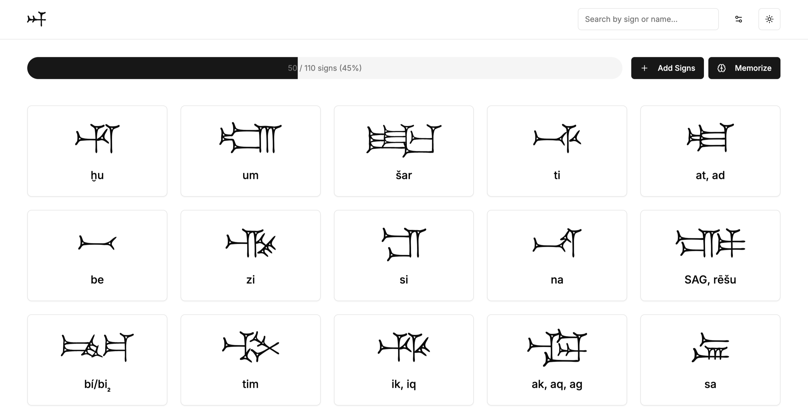

# Cuneiform Explorer



[Cuneiform Explorer](https://cuneiform-explorer.vercel.app/) is a modern web application built with Next.js that helps users explore and learn the ancient cuneiform script. It provides an interactive platform for studying, organizing, and memorizing cuneiform signs, making the learning process more efficient and engaging.

## Features

- Explore cuneiform signs through an interactive interface
- Practice and reinforce memory with built-in exercises
- Clean, responsive user interface built with Tailwind CSS
- Seamless dark mode support for comfortable viewing
- Type-safe codebase powered by TypeScript

## Tech Stack

- **Framework**: Next.js 15
- **Language**: TypeScript
- **Styling**: Tailwind CSS
- **UI Components**: Radix UI
- **Form Handling**: React Hook Form with Zod validation
- **State Management**: React Hooks
- **Animation**: Framer Motion

## Getting Started

### Prerequisites

- Node.js (v18 or higher)
- npm or pnpm

### Installation

1. Clone the repository:
```bash
git clone https://github.com/yourusername/cuneiform-explorer.git
cd cuneiform-explorer
```

2. Install dependencies:
```bash
npm install
# or
pnpm install
```

3. Run the development server:
```bash
npm run dev
# or
pnpm dev
```

4. Open [http://localhost:3000](http://localhost:3000) in your browser to see the application.

## Cuneiform Font

The cuneiform font is not built into the website, as different users may have different font preferences. If you'd like to use the same font shown in the screenshot, you can download the Assurbanipal cuneiform font from [https://www.hethport.uni-wuerzburg.de/cuneifont](https://www.hethport.uni-wuerzburg.de/cuneifont)

To set it up:

**Google Chrome**

Go to `Settings > Appearance > Customize fonts > Standard font`, and select `Assurbanipal`.

**Firefox**

Go to `Settings > General > Fonts > Advanced`, then set Sans-serif to `Assurbanipal`.

## Project Structure

```
cuneiform-explorer/
├── app/                # Next.js app directory
│   ├── api/            # API routes
│   ├── memorize/       # Memorization features
│   ├── types/          # TypeScript type definitions
│   └── ...
├── components/         # Reusable UI components
├── hooks/              # Custom React hooks
├── lib/                # Utility functions and configurations
├── styles/             # Global styles
└── ...
```

## Contributing

Contributions are welcome! Please feel free to submit a Pull Request.
